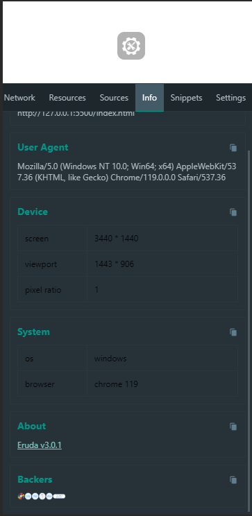

# dev-tools

```html
<script src="https://zavx0z.github.io/dev-tools/index.js" type="module"></script>
<script type="module">
  await new Promise((res) => import("https://zavx0z.github.io/dev-tools/index.js").then(() => setTimeout(res, 200)))
</script>
```
```html
<dev-tools mobile></dev-tools>
```


